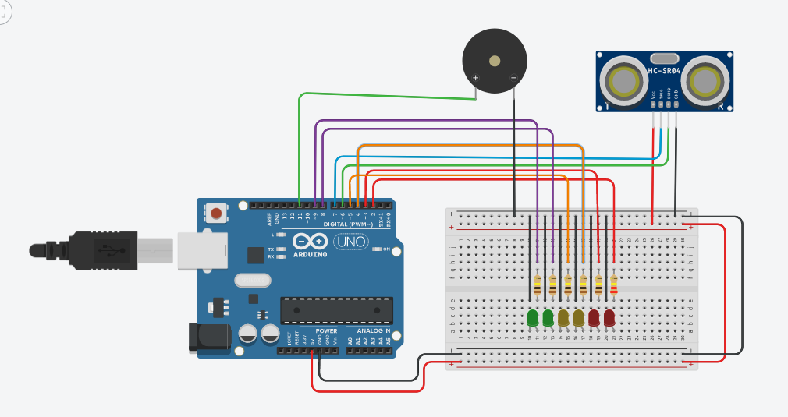

# Ultrasonic Sensor Project with Arduino

This repository contains the source code and circuit diagram of a college project for an ultrasonic 
sensor built with an Arduino board. The project uses an ultrasonic sensor to detect the distance between 
an object and the sensor, and based on the distance, it triggers different actions such as turning 
on/off LEDs and playing tones.

### Materials

A list of all the necessary materials for the project:

* Arduino Uno board
* Ultrasonic Sensor
* Buzzer
* LED's (Red, Yellow, Green)
* Breadboard
* Jumper wires
* Resistor's

### Circuit Diagram 

A visual representation of the circuit used for the Project

### Installation

1. Clone the repository: `git clone https://github.com/devpedrofurquim/Movement-Sensor-with-Arduino`
2. Upload the code to your Arduino board using the Arduino IDE.
3. Connect the ultrasonic sensor and the other components as shown in the circuit diagram.
4. Power on the Arduino board and the circuit.

### Usage

1. Power on the circuit.
2. Move objects in front of the ultrasonic sensor to trigger the different outputs.
3. Monitor the distance readings in the Arduino Serial Monitor.

## Contributing

Contributions are welcome. Please submit a pull request or open an issue to discuss potential changes.

